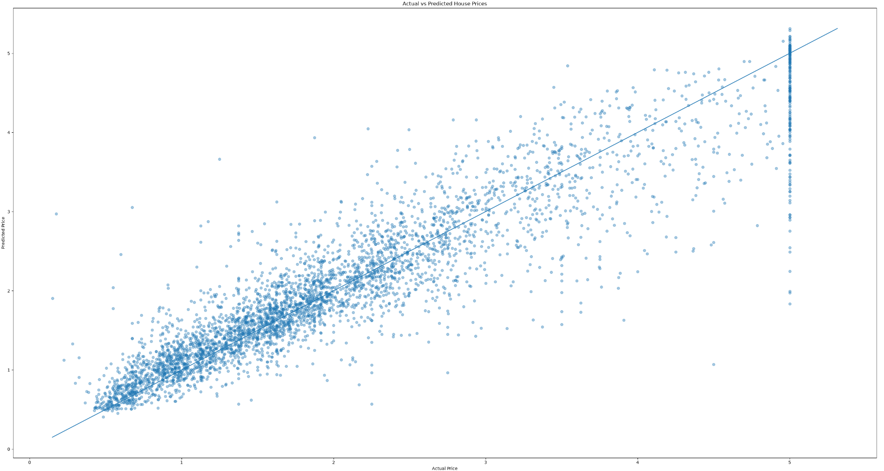

# California House Price Prediction

This project predicts California house prices using scikit-learn.

The goal is to compare several regression models, evaluate them, and improve the predictions through model selection and hyperparameter tuning.

## 1. Dataset

The project uses the California Housing dataset from scikit-learn.


## 2. Project Workflow

The machine learning workflow used in this project is:

```
Load dataset
    ↓
Explore the data
    ↓
Train/test split
    ↓
Compare several models with cross-validation
    ↓
Select a promising model
    ↓
Tune its hyperparameters
    ↓
Evaluate on the test set
    ↓
Analyze predictions
```

## 3. Models
### Dummy Regressor
The DummyRegressor is used as a baseline.

### Linear Regression
Linear regression models the target as a weighted sum of the input features. 
### Random Forest
A random forest combines many decision trees and averages their predictions. Each tree learns nonlinear rules from different subsets of the data, which helps reduce overfitting compared with a single decision tree. 
### Histogram Gradient Boosting
HistGradientBoostingRegressor builds decision trees sequentially, where each new tree tries to correct the errors made by the previous trees. It uses histogram-based splits to make training more efficient. This often gives better performance than random forests on structured data

## Pre-training data inspection
Before training any models, I first inspect the dataset to understand its structure and identify potential data-quality issues. The California Housing dataset contains 20,640 rows and 8 numerical features, with no missing values, so no imputation or categorical encoding is required.I also examine summary statistics to understand the feature ranges and detect extreme values. Some features, especially AveRooms, AveBedrms, and AveOccup, contain unusually large values compared with their typical range. These are treated as potential outliers and investigated rather than removed automatically.


The target variable, MedHouseVal, is stored in units of $100,000 and is capped at approximately 5.00001, corresponding to about $500,001. This means the most expensive houses are censored at the same maximum value, which is an important limitation of the dataset and affects evaluation in the upper price range

## Model Evaluation

To compare the models fairly, I evaluate them using the same training data, cross-validation setup, and error metric. I use **5-fold cross-validation**, which trains and validates each model five times on different parts of the training set. This gives a more reliable estimate of generalization performance than relying on a single validation split.

The main metric is **Mean Absolute Error (MAE)**.

Example results:

```text
Dummy                $88,601
Linear Regression    $52,906
Random Forest        $33,385
Gradient Boosting    $31,661
XGBoost              $31,064
```

These results show that the tree-based ensemble models perform substantially better than the simpler baseline and linear model. This makes sense intuitively, because these models capture non-linear relatioships much better. 

## Hyperparameter Tuning

I use `RandomizedSearchCV` to test different hyperparameter combinations efficiently. Each sampled configuration is evaluated with 5-fold cross-validation, and the combination with the lowest validation MAE is selected.

For `HistGradientBoostingRegressor`, I tune parameters such as:

```text
learning_rate
max_iter
max_leaf_nodes
max_depth
min_samples_leaf
l2_regularization
max_features
```
## Prediction Analysis

The final prediction plot shows that the model generally follows the expected relationship between actual and predicted house prices. Most predictions are distributed close to the diagonal, which indicates that the model captures the overall structure of the dataset reasonably well.

The predictions become less accurate in the higher price range. In particular, many observations are concentrated at an actual value of approximately `5.0`, corresponding to the dataset's `$500,001` target cap. Since values above this limit are censored, the model cannot learn the true differences between these high-value properties.

There are also a few larger prediction errors caused by unusual feature values. For example, some districts contain extremely high values for `AveRooms` or `AveOccup`. These observations were investigated rather than automatically removed, since an unusual value is not necessarily an invalid one.

Overall, the results show that the model performs well for most of the price range, while predictions become more uncertain for expensive properties and unusual observations. This suggests that part of the remaining error comes from limitations and outliers in the dataset rather than only from the model itself.
